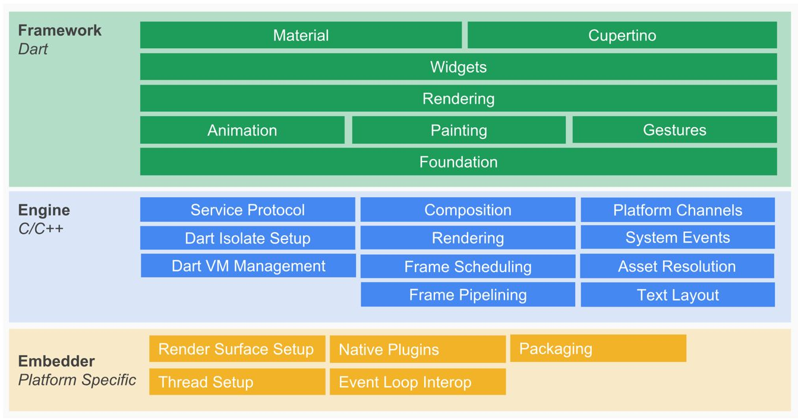
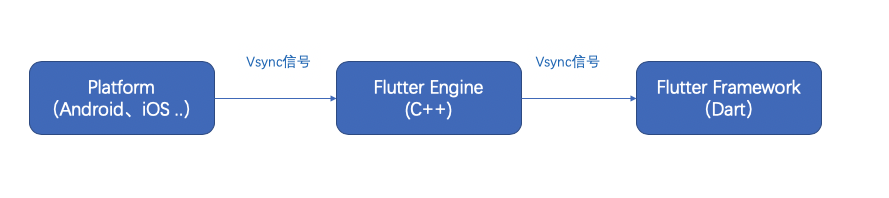
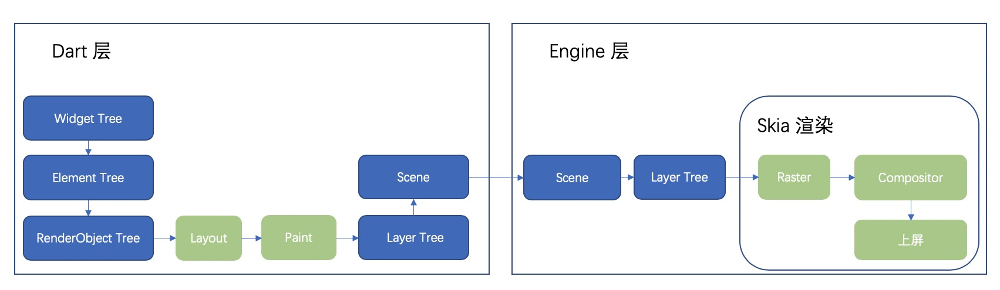

Date: 2021-09-19
Title: Flutter framework源码学习（一）
Category: 技术
Tags: Flutter framework

# Flutter framework源码学习（一）
以下内容只是我在团队技术分享里的keynote的摘录，实际上在分享会上会补充很多细节，这里就略过了。
## Flutter架构
Flutter主要分为engine层，framework层和embeder层，engine层主要用c++写的，framework层主要是Dart语言写的，embedder层主要是平台相关的native语言写的。这里framework的源码最容易获得，也最方便容易学习。当你安装好Flutter环境之后，在Android studio打开任意Flutter项目，就可以从你的项目代码跳转到framework代码进行研究，这边跟Android是差不都的。



## Flutter framework 源码目录说明

* 基于stable分支，Flutter 2.2.3版本，Dart 2.12.3
* flutter/packages/flutter/lib目录下：522个文件，378733行代码（大量注释）
* 重要源码目录说明

| 目录 | 说明 | 
| ------ | ------ | 
| flutter/packages/flutter/lib |	framework源码 |
| flutter/example/layers/raw | raw目录下的例子有助于理解framework的底层layer |
| flutter/bin/cache/artifacts/engine | 编译后的engine二进制文件 |
| flutter/bin/cache/dart-sdk | dark sdk源码 |
| flutter/bin/cache/pkg/sky_engine/lib | framework底层源码 |

### 源码特点

* 大量使用断言：普通的断言语句和断言代码块
* 大量使用mixin来复用代码
* 类属性使用getter和setter访问器
* 异常捕获：try-catch-finally 增强程序健壮性
* 用native关键字来定义在c++实现的方法
* @pragma(‘vm:entry-point')表明类或属性在c++中使用
* 特别的语法：级联操作符 .. ，is! (当对象不是相应类型时返回 true)
* 特别表达式：result = expr1 ?? expr2（若expr1为null, 返回expr2的值，否则返回expr1的值）；expr1 ??= expr2（若expr1为null, 则把expr2的值赋值给expr1）

## framework启动流程
* 默认找main.dart下的main方法
* 启动流程：main—>runApp->WidgetsFlutterBinding.ensureInitialized—>BindingBase构造函数—>XXBinding.initInstances

关键代码

````dart
oid runApp(Widget app) {
  WidgetsFlutterBinding.ensureInitialized()
    ..scheduleAttachRootWidget(app)
    ..scheduleWarmUpFrame();
}
static WidgetsBinding ensureInitialized() {
    if (WidgetsBinding.instance == null)
      WidgetsFlutterBinding();
    return WidgetsBinding.instance!;
  }
BindingBase() {
     ....
    initInstances();
    .....
  }
````

### mixin: 代码复用的利器
* 用mixin关键字定义，用on实现mixin的继承机制（类似），用with来使用mixin
一个类A使用了一个mixin B，可以简单理解为 A继承于B
* Class C extends B with A, 如果A，B，C中有同名方法，C的不会被覆盖。如果只有A， B有同名方法，A会覆盖B的方法。本类最优先，mixin比父类优先
* 如果一个mixin A继承了(on)多个其他的mixin，那么一个类在使用（with）A时，必须也要使用其他的mixin。mixin使用通过super调用父mixin的方法。
* 一个类使用（with）了多个mixin，那么出现同名冲突时最右的优先级最高(可以认为从右往左单向继承，越往左父层级越高)
* mixin本质是一个没有构造函数的类。不能直接实例化，专门用来代码复用，实现多继承的机制，但是没有c++多继承那么复杂。
* dart run test_main.dart 可直接运行dart源码，这很方便写测试代码

把上面5点都理解了，就理解了mixin的本质。我为了理解BindingXXX的启动流程，自己写了个类似的测试代码：[test_mixin](https://github.com/szuwest/code_lib/blob/main/test_mixin.dart)

### initInstances方法调用链
**initInstances方法调用链: WidgetsBinding—>RendererBinding—>SemanticsBinding—>PaintingBinding—>ServicesBinding—>SchedulerBinding—>GestureBinding—>BindingBase**

| Binding类 | 说明 | 
| ------ | ------ | 
| GestureBinding | 提供了 window.onPointerDataPacket 回调，绑定 Framework 手势子系统，是 Framework 事件模型与底层事件的绑定入口 |
| ServicesBinding | 提供了 window.onPlatformMessage 回调， 用于绑定平台消息通道（message channel），主要处理原生和 Flutter 通信 | 
| SchedulerBinding | 提供了 window.onBeginFrame 和 window.onDrawFrame 回调，监听刷新事件，绑定 Framework 绘制调度子系统 |
| PaintingBinding | 绑定绘制库，主要用于处理图片缓存 |
| SemanticsBinding | 语义化层与 Flutter engine 的桥梁，主要是辅助功能的底层支持 |
| RendererBinding | 提供了 window.onMetricsChanged 、window.onTextScaleFactorChanged 等回调。持有PipelineOwner和RenderView(Root RenderObject), 它是渲染树与 Flutter engine 的桥梁 |
| WidgetsBinding | 提供了 window.onLocaleChanged、onBuildScheduled 等回调。持有BuildOwner和Root Element, 它是 Flutter widget 层与 engine 的桥梁 |
| BindingBase | 是其他Binding的基类，主要定义initInstances方法和公有属性window |

### 三个树的创建
* 通过attachRootWidget方法先后创建了RenderObjectToWidgetAdapter和RenderObjectToWidgetElement
* RenderObjectToWidgetAdapter是root widget，它的child是APP的顶层widget。RenderObjectToWidgetAdapter的key是GlobalObjectKey
* RenderObjectToWidgetElement是root element, 持有root widget和root RenderObject。它被创建之后调用了mount方法。
* RenderView是 root RenderObject，由RenderBinding创建，它持有window
* WidgetBinding持有root element，而root element持有root widget和render object。

### window：Framework和Engine的桥梁
* ui.window是SingletonFlutterWindow，是Framework和Engine的桥梁，封装了原生跟flutter dart之间的各种回调。最后的UI渲染就是通过它传给engine的
* UI渲染数据是通过render方法传给engine层的
* window持有PlatformDispatcher，几乎所有的回调都是通过PlatformDispatcher来跟平台交互的
* onBeginFrame和onDrawFrame由engine主动调用，这两个callback都在SchedulerBinding里设置了。onBeginFrame最终会调用到一些动画相关的东西，onDrawFrame会调用到drawFrame，并将渲染数据通过window的render传给engine
* scheduleFrame:由flutter层调用，告知engine适时（VSync信号到来）回调onBeginFrame和onDrawFrame
* scheduleFrame和onDrawFrame配合就可以做到不断的更新界面

window这个类很关键，不同的framework版本还不太一样，但是渲染更新的接口都在这。

### VSync信号
 不管是手机还是电脑，为了更新显示画面，显示器是以固定的频率刷新的。当一帧图像绘制完毕后准备绘制下一帧时，显示器会发出一个垂直同步信号（VSync）
 下面两种图可以帮助理解VSync信号原理
 
 
 
## Flutter帧渲染的整体流程
 通过Widget Tree和Element Tree生成绘制树RenderObject Tree。RenderObject Tree会再进行Layout布局和Paint渲染等步骤生成Layer Tree，组装成scene，通过window传给engine层。在Flutter Engine层中，主要对Layer Tree进行光栅化、合成和上屏的操作。flutter中的layer，scene实际上只是c++层中的layer，scene的封装.
 
  
 
 
## 扩展：直接使用layer和window渲染界面
 * 直接绕过三个树，采用底层layer来画控件（又回到命令式编程），连XXBinding的初始化都省了
 * flutter/example/layers/raw的例子
 
raw目录下的例子真的挺有意思，一定要去看看，有意想不到的收获。

## 参考资料
* [Flutter 核心原理与混合开发模式](https://zhuanlan.zhihu.com/p/158089384)
* [Flutter框架层启动源码剖析](https://zhuanlan.zhihu.com/p/208798157)
* [Flutter UI渲染分析](https://blog.csdn.net/XSF50717/article/details/104279579)
* [Flutter 核心原理：Flutter帧渲染的整体流程](https://xiaozhuanlan.com/topic/7610425893)
* [Flutter Framework 源码解析（ 1 ）—— 开篇和绘图引擎的用法](https://xieguanglei.github.io/blog/post/flutter-code-chapter-01.html)


----------------
如果你觉得这篇文章有用，请打赏小钱喝杯咖啡^_^
